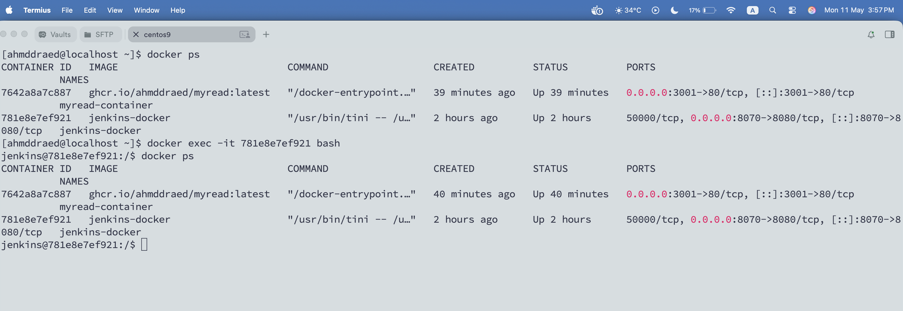
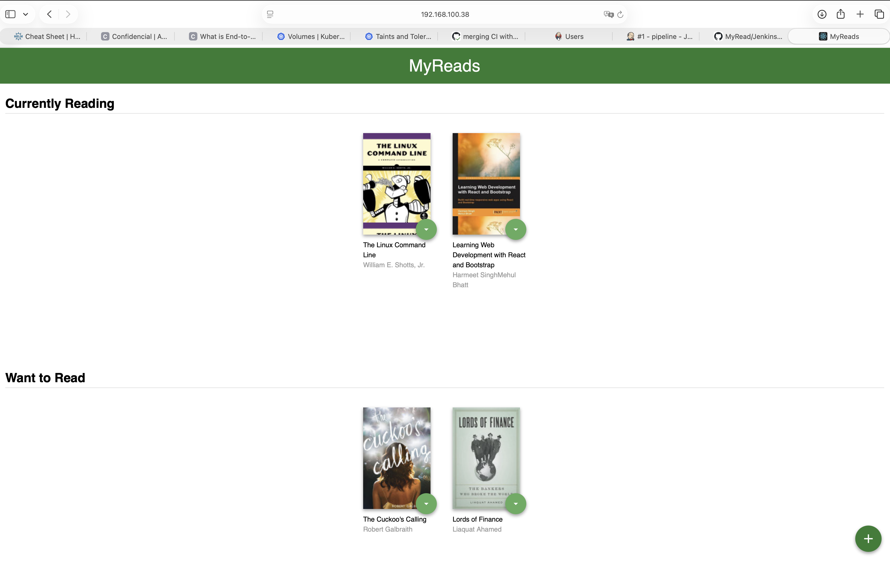
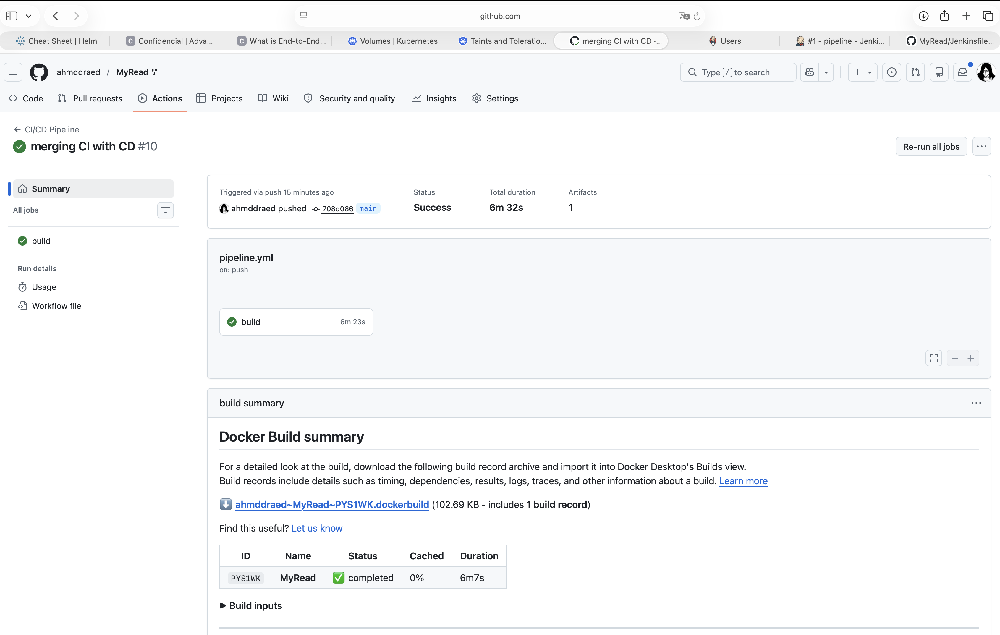
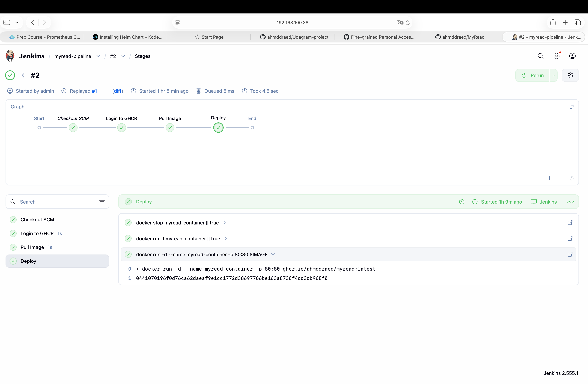

## MyRead - CI/CD Deployment Project

This project demonstrates a complete DevOps workflow for containerizing, building, and deploying the MyRead application using Docker, GitHub Actions, GitHub Container Registry (GHCR), and Jenkins.

---

# Project Overview

The project includes:

- Multi-stage Docker build for optimized container images
- Nginx configuration for serving the frontend application
- CI pipeline using GitHub Actions
- Image publishing to GitHub Container Registry (GHCR)
- Jenkins container customized with Docker CLI
- CD pipeline using Jenkins for automated deployment

---

# Containerization

The application was containerized using a **multi-stage Docker build**:

## Stage 1 - Build Stage
- Uses Node.js image
- Installs dependencies using `npm`
- Builds the React application

## Stage 2 - Production Stage
- Uses lightweight Nginx image
- Copies the build artifacts from Stage 1
- Uses custom `nginx.conf`
- Serves the application through Nginx

---

# CI Pipeline (GitHub Actions)

A CI pipeline was created using GitHub Actions to:

1. Checkout the source code
2. Setup Docker Buildx
3. Build the Docker image
4. Push the image to GitHub Container Registry (GHCR)

The pipeline supports:
- Multi-architecture builds
  - linux/amd64
  - linux/arm64

---

# Container Registry

Docker images are pushed to:

```bash
ghcr.io/ahmddraed/myread
```
# Jenkins Custom Docker Image

A custom Jenkins Docker image was created to include:
- Docker CLI
- Required Docker dependencies
This allows Jenkins pipelines to:
- Pull Docker images
- Run containers
- Manage deployments directly from inside the Jenkins 



run the image by : 
``` bash 
docker run -d \
  -p 8080:8080 \
  -v /var/run/docker.sock:/var/run/docker.sock \
  --group-add 984 \
  --name jenkins-docker \
  ahmddraed/jenkins-docker
  ```
#  CD pipeline (jenkins)

A Continuous Deployment pipeline was implemented using Jenkins.
The pipeline performs:

- Pull latest image from GHCR
- Stop old container (if exists)
- Remove old container
- Run the new application container

# Technologies
- Docker
- Nginx
- GitHub Actions
- Jenkins
- Node.js

# Run Locally
- clone the repo in your local machine:
```bash 
git clone https://github.com/ahmddraed/MyRead.git
```
- cd to jenkins dir and run:
``` bash 
docker run -d \
  -p 8080:8080 \
  -v /var/run/docker.sock:/var/run/docker.sock \
  --group-add 984 \
  --name jenkins-docker \
  ahmddraed/jenkins-docker
  ```
  - configure your jenkins pipeline to get from scm and run the Jenkinsfile via github
  - go to your browser and hit http://<UR_MACHINE_IP>

## Application Screenshot



# CI Pipeline



# CD Pipeline




